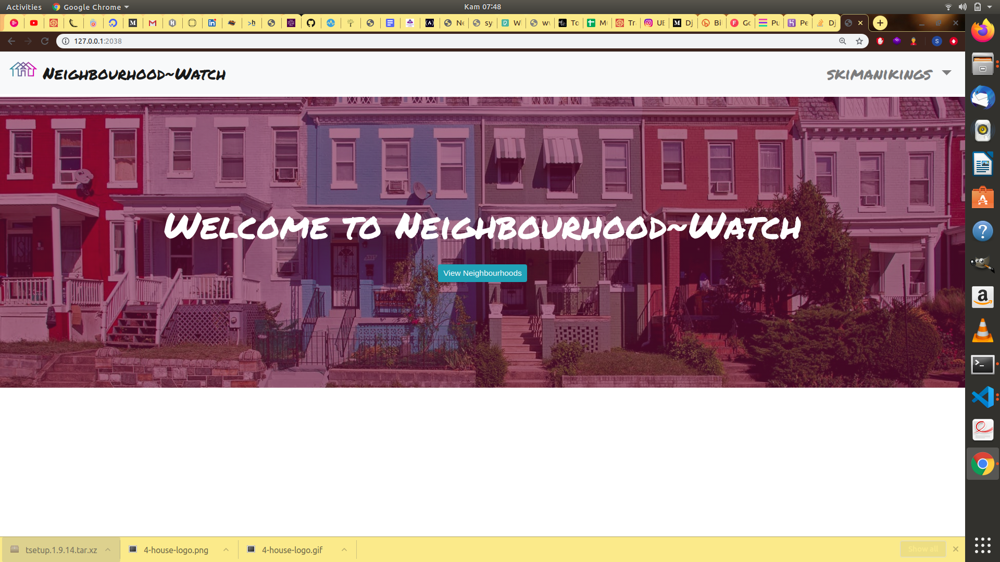

# Neighbourhood~Watch.

##### By skimanikings

# Description  
This is a Django made application that allows users to: 
* Sign in with the application to start using.
* Set up a profile about me and a general location and my neighborhood name.
* Find a list of different businesses in my neighborhood.
* Find Contact Information for the health department and Police authorities near my neighborhood.
* Create Posts that will be visible to everyone in my neighborhood.
* Change My neighborhood when I decide to move out.
* Only view details of a single neighborhood.  

This is a Django app where you can register, log in and join a neighborhood or create one if it's not already there. You can only join a single neighborhood. Inside a neighborhood, you can view and also create posts.
## Project Sceenshots

 
## Project links
Github link:  https://github.com/SkimaniKings/Neighbourhood.git 

Live site: [View Site]( https://tinghoods.herokuapp.com/)

  
## Setup and Installation  
To get the project,here is a list of commands: 
  
##### Clone the repository:  
`git clone https://github.com/SkimaniKings/Neighbourhood.git `

##### Install and activate Virtual  

- `pip install pipenv` 
- `pipenv shell`

##### Navigate into the folder:
 
`cd neighborhood`

##### Install Dependencies  
 
 `pip install -r requirements.txt`  

##### Run the application  
 
 `python manage.py runserver`

Open the application on your browser `127.0.0.1:8000`.  
 
 
 
## Technology used  
  
* [Python3.6](https://www.python.org/)  
* [Django 2.2](https://docs.djangoproject.com/en/1.1/)  
* [Heroku](https://heroku.com)  
  
  
## Known Bugs  
* There are no known bugs at the moment.
  
## Contact Information   
If you have any question or contributions, please email me at kimanisimon856@gmail.com 
You can also reach me through - O713813919

## Licence
The MIT License (MIT)

Copyright (c) 2020 kimanisimon

Permission is hereby granted, free of charge, to any person obtaining a copy of this software and associated documentation files (the "Software"), to deal in the Software without restriction, including without limitation the rights to use, copy, modify, merge, publish, distribute, sublicense, and/or sell copies of the Software, and to permit persons to whom the Software is furnished to do so, subject to the following conditions:

The above copyright notice and this permission notice shall be included in all copies or substantial portions of the Software.

THE SOFTWARE IS PROVIDED "AS IS", WITHOUT WARRANTY OF ANY KIND, EXPRESS OR IMPLIED, INCLUDING BUT NOT LIMITED TO THE WARRANTIES OF MERCHANTABILITY, FITNESS FOR A PARTICULAR PURPOSE AND NONINFRINGEMENT. IN NO EVENT SHALL THE AUTHORS OR COPYRIGHT HOLDERS BE LIABLE FOR ANY CLAIM, DAMAGES OR OTHER LIABILITY, WHETHER IN AN ACTION OF CONTRACT, TORT OR OTHERWISE, ARISING FROM, OUT OF OR IN CONNECTION WITH THE SOFTWARE OR THE USE OR OTHER DEALINGS IN THE SOFTWARE.
  

 Copyright (c) 2020 **Kimani Simon** 